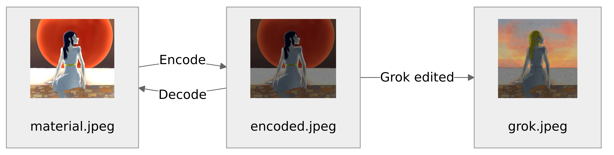
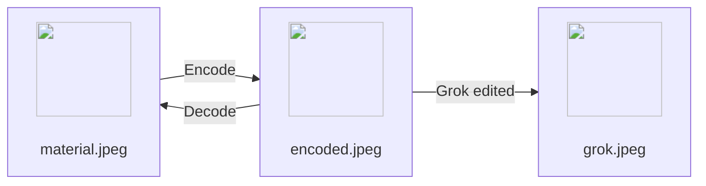

<div align="center">

<h1>Quantum Pixel</h1>

**When everything is possibility.**

[![][latest-release-shield]][latest-release-url]
[![][latest-commit-shield]][latest-commit-url]
[![][pypi-shield]][pypi-url]
[![][python-shield]][python-url]

[latest-release-shield]: https://badgen.net/github/release/Linos1391/quantum-pixel/development?icon=github
[latest-release-url]: https://github.com/Linos1391/quantum-pixel/releases/latest
[latest-commit-shield]: https://badgen.net/github/last-commit/Linos1391/quantum-pixel/master?icon=github
[latest-commit-url]: https://github.com/Linos1391/quantum-pixel/commits/master
[pypi-shield]: https://img.shields.io/badge/pypi-quantum--pixel-blue
[pypi-url]: https://pypi.org/project/quantum-pixel/
[python-shield]: https://img.shields.io/badge/python-3.14+-yellow
[python-url]: https://www.python.org/downloads/


</div>
<br>

>"When I think about it, maybe quantum mechanics was made to prevent AI. Like being both wave and particle, we as players perceive the environment normally, and computers got strokes while analyzing. Thats why we forgot the precedent memory to prevent AI screenshot reality."
>
> &mdash; <cite>**Me** in Dec 11th 2025 for absolutely no reasons.</cite>

<br>

- [1. Introduction](#1-introduction)
  - [1.1. Web service](#11-web-service)
  - [1.2. Local system](#12-local-system)
- [2. Can I host from Github?](#2-can-i-host-from-github)
- [3. License](#3-license)
- [4. Disclaimer](#4-disclaimer)


<br>

# 1. Introduction

I made this in response of AI slop. Those so-called AI artists had gone too far that annoy me... I am not against the development of AI, but the disrespects towards ARTS and ARTISTS.


<details>
  <summary>Mermaid source (github only)</summary>



</details>

<br>

**Notice:** it is still in development and not guaranteed protected from img2img. I tried on Grok some details are detected, most are NOT :D.

## 1.1. Web service

Really slow so be patient!
- [quantum-pixel.onrender.com/](https://quantum-pixel.onrender.com/)

## 1.2. Local system

```
git clone https://github.com/Linos1391/quantum-pixel.git
cd quantum-pixel
```

| uv (recommended)                                   | python                            |
| -------------------------------------------------- | --------------------------------- |
| `uv sync --locked --no-dev && uv cache prune --ci` | `pip install -r requirements.txt` |
| `uv run -- uvicorn src.web:app --host 0.0.0.0`     | `fastapi run src`                 |

<br>

# 2. Can I host from [Github](https://github.com/Linos1391/quantum-pixel)?

- For private use or sharing with friends? Absolutely yes. I am using the free version of Render right now and totally recommend to try.

- For your website? You may embed this project as it is and let it be entirely free.

<br>

# 3. License

[GNU GPLv3](LICENSE)

<br>

# 4. Disclaimer

Remember, this will NOT 100% prevent AI from analyzing; in fact, the process of Steganography is open-source. I am still researching for better algorithms and would love to hear from YOU!
